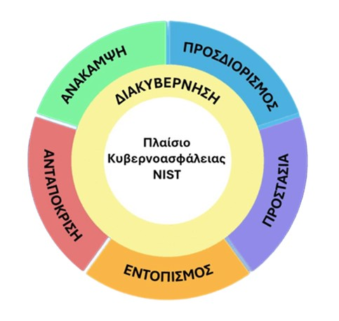

# Πτυχιακή Εργασία με τίτλο:   "Εφαρμογή Μεθόδων και Τεχνικών Τεχνητής Νοημοσύνης για την Ασφάλεια Συστημάτων Λογισμικού"

## Περιγραφή

Αυτή η πτυχιακή εργασία εξετάζει την εφαρμογή τεχνητής νοημοσύνης (AI) στο πλαίσιο του NIST Cybersecurity Framework (CSF), ενός καθιερωμένου οδηγού για την ενίσχυση της κυβερνοασφάλειας οργανισμών. Μέσα από μια λεπτομερή ανάλυση, η εργασία διερευνά πώς οι σύγχρονες τεχνικές AI, όπως η μηχανική και βαθιά μάθηση, μπορούν να συμβάλουν στην πρόληψη, ανίχνευση, αντίδραση και αποκατάσταση από κυβερνοεπιθέσεις.

Βασισμένη σε πρόσφατες έρευνες, η μελέτη οργανώνεται γύρω από τις τέσσερις βασικές λειτουργίες του NIST: 

<li>προσδιορισμό απειλών</li> 
<li>προστασία μέσω μέτρων άμυνας</li> 
<li>εντοπισμό κυβερνοεπιθέσεων σε πραγματικό χρόνο</li>
<li>ανταπόκριση σε επιθέσεις</li> 

Μέσω αυτής της ολιστικής προσέγγισης η εργασία αναδεικνύει τη σημασία της AI στην ενίσχυση της κυβερνοασφάλειας και προτείνει βέλτιστες πρακτικές για την εφαρμογή της.

## Επιμέλεια Εργασίας

<li>Η πτυχιακή εργασία δημιουργήθηκε κατά το ακαδημαϊκό έτος 2024-2025.</li> 